<!-- ─── Language Switch & ToC (top-right) ──────────────────────────── -->
<div align="right">

<span style="color:#999;">🇺🇸 English</span> ·
<a href="README.zh-CN.md">🇨🇳 中文</a>
&nbsp;&nbsp;&nbsp;&nbsp;&nbsp;&nbsp;|&nbsp;&nbsp;&nbsp;&nbsp;&nbsp;
Table&nbsp;of&nbsp;Contents&nbsp;↗️

</div>

<h1 align="center"><code>jenkins-sdk-rust</code></h1>

<p align="center">
  📦 <strong>Jenkins API SDK in pure Rust</strong> — async <em>and</em> blocking clients, typed endpoints, pluggable middleware &amp; zero magic strings.
</p>

<div align="center">
  <a href="https://crates.io/crates/jenkins-sdk">
    
  </a>
  <a href="https://docs.rs/jenkins-sdk">
    
  </a>
  <a href="https://github.com/lvillis/jenkins-sdk-rust/actions">
    
  </a>
  <a href="https://img.shields.io/crates/dr/jenkins-sdk?color=ba86eb">
    
  </a>
  <a href="https://github.com/lvillis/jenkins-sdk-rust">
    
  </a>
  <a href="mailto:lvillis@outlook.com?subject=Thanks%20for%20jenkins-sdk-rust!">
    
  </a>
</div>

---

## ✨ Features

| Feature                   | Description                                                                             |
|---------------------------|-----------------------------------------------------------------------------------------|
| **Async *and* Blocking**  | Choose the I/O model at _compile-time_: async by default, enable `blocking` for non-async environments. |
| **Core services**         | Discoverable `client.jobs()/queue()/system()/...` APIs — no manual path building.       |
| **Composable middleware** | Ready-made CSRF-crumb fetching, retries, custom transports — just chain builders.       |
| **No magic strings**      | URL build, query/form encoding, error mapping & JSON decoding handled for you.          |
| **Pure Rust, tiny deps**  | Built on <code>reqwest</code> + <code>rustls</code>; no C bindings, minimal footprint.  |

## 🖼 Architecture

```mermaid
flowchart LR
%% ── Your App ──────────────────────────
  subgraph A["Your&nbsp;App"]
    direction TB
    CLI["Binary / Service"]
  end

%% ── SDK Core ──────────────────────────
  subgraph S["jenkins-sdk-rust"]
    direction LR
    Builder["Client&nbsp;Builder"] --> Client["Jenkins<br/>Async&nbsp;/&nbsp;Blocking"] --> Middleware["Middleware<br/><sub>retry • crumbs • custom</sub>"] --> Service["Core&nbsp;Services<br/><sub>jobs • queue • system • ...</sub>"]
  end

%% ── External ──────────────────────────
  subgraph J["Jenkins&nbsp;Master"]
    direction TB
    API["REST&nbsp;API"]
  end

%% ── Flows ─────────────────────────────
  CLI --> Builder
  Service --> API
%% ── Styling ───────────────────────────
  classDef app fill:#e3f2fd,stroke:#1976d2,stroke-width:1px;
  classDef sdk fill:#e8f5e9,stroke:#388e3c,stroke-width:1px;
  classDef server fill:#fff8e1,stroke:#f57f17,stroke-width:1px;
  class CLI app;
  class Builder,Client,Middleware,Service sdk;
  class API server;
```

<details open>
<summary>Quick-glance architecture (click to collapse)</summary>



</details>

## 🚀 Supported API Matrix

| Service       | APIs (core)                                                                                                                                                                                                                                                         | Status |
|---------------|---------------------------------------------------------------------------------------------------------------------------------------------------------------------------------------------------------------------------------------------------------------------|--------|
| `system()`    | `/api/json`, `/whoAmI/api/json`, `/crumbIssuer/api/json`, `/overallLoad/api/json`, `/loadStatistics/api/json`, `/jnlpJars/agent.jar`, `/jnlpJars/jenkins-cli.jar`, `/config.xml` get/update, `/quietDown`/`cancelQuietDown`/`reload`/`safeRestart`/`restart`/`exit` | ✅      |
| `jobs()`      | list/get + lastBuild selectors, build info, `consoleText`, `logText/progressiveText`, artifact download, stop/term/kill/doDelete/toggleLogKeep/submitDescription, `config.xml` get/update, `createItem`(xml), copy/rename/delete/enable/disable                     | ✅      |
| `queue()`     | list/item/cancel                                                                                                                                                                                                                                                    | ✅      |
| `computers()` | list/computer + typed `executors_info()`, `doCreateItem`(xml)/copy, toggleOffline/doDelete, `config.xml` get/update, connect/disconnect/launchSlaveAgent                                                                                                            | ✅      |
| `views()`     | list/get, createView(xml), `config.xml` get/update, doDelete/doRename, addJobToView/removeJobFromView                                                                                                                                                               | ✅      |
| `users()`     | `/user/<id>/api/json`, `/whoAmI/api/json`, `config.xml` get/update                                                                                                                                                                                                  | ✅      |
| `people()`    | `/people/api/json`, `/asynchPeople/api/json`                                                                                                                                                                                                                        | ✅      |

## 📥 Installation

```shell
# quickest
cargo add jenkins-sdk
```

```toml
# Cargo.toml — async client (default)
[dependencies]
jenkins-sdk = "0.1"

# blocking client (choose one TLS backend)
# jenkins-sdk = { version = "0.1", default-features = false, features = ["blocking", "rustls"] }
# jenkins-sdk = { version = "0.1", default-features = false, features = ["blocking", "native-tls"] }
```

## ⚡Quick Start

> Base URL can include a sub-path (e.g. `https://example.com/jenkins`); a trailing `/` is optional,
> the SDK normalises it for you.

### Async Example

```rust
use jenkins_sdk::Client;
use std::time::Duration;

#[tokio::main]
async fn main() -> Result<(), jenkins_sdk::Error> {
  // Build a client with some sugar ‑‑>
  let j = Client::builder("https://jenkins.example.com")?
    .auth_basic("user", "apitoken")
    .no_system_proxy()
    .with_retry(3, Duration::from_millis(300))
    .with_crumb(Duration::from_secs(1800))
    .build()?;

  // Queue length
  let q: serde_json::Value = j.queue().list(None).await?;
  println!("queue items = {}", q["items"].as_array().map_or(0, |a| a.len()));

  // Executor stats (typed deserialisation)
  let mut ex = j.computers().executors_info().await?;
  ex = ex.calc_idle();
  println!("idle executors = {}", ex.idle_executors);

  // Raw job list
  let jobs: serde_json::Value = j.jobs().list().await?;
  println!("first job = {}", jobs["jobs"][0]["name"]);

  Ok(())
}

```

### Blocking Example

```rust
// Compile with `default-features = false, features = ["blocking", "rustls"]`
// or `default-features = false, features = ["blocking", "native-tls"]`.
use jenkins_sdk::BlockingClient;
use std::time::Duration;

fn main() -> Result<(), jenkins_sdk::Error> {
  let j = BlockingClient::builder("https://jenkins.example.com")?
    .auth_basic("user", "apitoken")
    .timeout(Duration::from_secs(15))
    .with_retry(2, Duration::from_millis(250))
    .build()?;

  let q: serde_json::Value = j.queue().list(None)?;
  println!("queue items = {}", q["items"].as_array().unwrap().len());
  Ok(())
}
```

### Any Endpoint (Unstable Raw Request)

Enable the `unstable-raw` feature and use `raw::Request` + `execute()` when an API endpoint isn't
modeled yet:

```rust
use jenkins_sdk::Client;
use jenkins_sdk::raw::Request;

# async fn demo(client: Client) -> Result<(), jenkins_sdk::Error> {
  let resp = client
    .execute(&Request::get(["api", "json"]).query_pair("tree", "jobs[name]"))
    .await?;
  let root: serde_json::Value = resp.json()?;
  println!("{root:?}");
  # Ok(())
  #
}
```

> Note: when using the blocking client inside a Tokio runtime, call it via
`tokio::task::spawn_blocking` or a dedicated thread pool.

## 📜 Changelog

See [CHANGELOG.md](CHANGELOG.md) for release notes.

## 📃 License

This project is licensed under the MIT License.
