<!-- ─── Language Switch & ToC (top-right) ──────────────────────────── -->
<div align="right">

<span style="color:#999;">🇺🇸 English</span> ·
<a href="README.zh-CN.md">🇨🇳 中文</a>&nbsp;&nbsp;&nbsp;&nbsp;&nbsp;&nbsp;|&nbsp;&nbsp;&nbsp;&nbsp;&nbsp; Table&nbsp;of&nbsp;Contents&nbsp;↗️

</div>

<h1 align="center"><code>jenkins-sdk-rust</code></h1>

<p align="center">
  📦 <strong>Jenkins API SDK in pure Rust</strong> — async <em>and</em> blocking clients, typed endpoints, pluggable middleware &amp; zero magic strings.
</p>

<div align="center">
  <a href="https://crates.io/crates/jenkins-sdk">
    
  </a>
  <a href="https://docs.rs/jenkins-sdk">
    
  </a>
  <a href="https://github.com/lvillis/jenkins-sdk-rust/actions">
    
  </a>
  <a href="https://img.shields.io/crates/dr/jenkins-sdk?color=ba86eb">
    
  </a>
  <a href="https://github.com/lvillis/jenkins-sdk-rust">
    
  </a>
  <a href="mailto:lvillis@outlook.com?subject=Thanks%20for%20jenkins-sdk-rust!">
    
  </a>
</div>

---

## ✨ Features

| Feature                   | Description                                                                                              |
|---------------------------|----------------------------------------------------------------------------------------------------------|
| **Async *and* Blocking**  | Choose the I/O model at _compile-time_: `tokio` by default, enable `blocking-client` for sync.           |
| **Type-safe endpoints**   | Each REST call is a zero-cost struct implementing `Endpoint`; responses deserialize into concrete types. |
| **Composable middleware** | Ready-made CSRF-crumb fetching, retries, custom transports — just chain builders.                        |
| **No magic strings**      | URL build, query/form encoding, error mapping & JSON decoding handled for you.                           |
| **Pure Rust, tiny deps**  | Built on <code>reqwest</code> + <code>rustls</code>; no C bindings, minimal footprint.                   |

## 🖼 Architecture

```mermaid
flowchart LR
%% ── Your App ──────────────────────────
  subgraph A["Your&nbsp;App"]
    direction TB
    CLI["Binary / Service"]
  end

%% ── SDK Core ──────────────────────────
  subgraph S["jenkins-sdk-rust"]
    direction LR
    Builder["Client&nbsp;Builder"] --> Client["Jenkins<br/>Async&nbsp;/&nbsp;Blocking"] --> Middleware["Middleware<br/><sub>retry • crumbs • custom</sub>"] --> Endpoint["Typed&nbsp;Endpoint<br/>structs"]
  end

%% ── External ──────────────────────────
  subgraph J["Jenkins&nbsp;Master"]
    direction TB
    API["REST&nbsp;API"]
  end

%% ── Flows ─────────────────────────────
  CLI --> Builder
  Endpoint --> API

%% ── Styling ───────────────────────────
  classDef app     fill:#e3f2fd,stroke:#1976d2,stroke-width:1px;
  classDef sdk     fill:#e8f5e9,stroke:#388e3c,stroke-width:1px;
  classDef server  fill:#fff8e1,stroke:#f57f17,stroke-width:1px;

  class CLI app;
  class Builder,Client,Middleware,Endpoint sdk;
  class API server;
```

<details open>
<summary>Quick-glance architecture (click to collapse)</summary>



</details>

## 🚀 Supported API Matrix

| Category | Description                             | Method | Path                               | Status |
|----------|-----------------------------------------|--------|------------------------------------|--------|
| Job      | Retrieve jobs information               | `GET`  | `/api/json`                        | ✅      |
| Job      | Fetch job details                       | `GET`  | `/job/:name/api/json`              | ✅      |
| Job      | Fetch last-build information            | `GET`  | `/job/:name/lastBuild/api/json`    | ✅      |
| Job      | Fetch console logs                      | `GET`  | `/job/:name/:id/consoleText`       | ✅      |
| Job      | Fetch last-build console log            | `GET`  | `/job/:name/lastBuild/consoleText` | ✅      |
| Job      | Trigger builds with parameters          | `POST` | `/job/:name/buildWithParameters`   | ✅      |
| Job      | Stop ongoing builds                     | `POST` | `/job/:name/:id/stop`              | ✅      |
| Queue    | Retrieve build queue details            | `GET`  | `/queue/api/json`                  | ✅      |
| Executor | Retrieve executor statistics and status | `GET`  | `/computer/api/json`               | ✅      |

## 📥 Installation

```shell
# quickest
cargo add jenkins-sdk
```

```toml
# Cargo.toml — async client (default)
[dependencies]
jenkins-sdk = "0.1"

# blocking client
# jenkins-sdk = { version = "0.1", default-features = false, features = ["blocking-client"] }
```

## ⚡Quick Start

### Async Example

```rust
use jenkins_sdk::{JenkinsAsync};
use jenkins_sdk::core::{QueueLength, JobsInfo, ExecutorsInfoEndpoint};
use std::time::Duration;

#[tokio::main]
async fn main() -> Result<(), jenkins_sdk::core::JenkinsError> {
    // Build a client with some sugar ‑‑>
    let j = JenkinsAsync::builder("https://jenkins.example.com")
        .auth_basic("user", "apitoken")
        .no_system_proxy()
        .with_retry(3, Duration::from_millis(300))
        .with_crumb(Duration::from_secs(1800))
        .build();

    // Queue length
    let q: serde_json::Value = j.request(&QueueLength).await?;
    println!("queue items = {}", q["items"].as_array().map_or(0, |a| a.len()));

    // Executor stats (typed deserialisation)
    let mut ex = j.request(&ExecutorsInfoEndpoint).await?;
    ex = ex.calc_idle();
    println!("idle executors = {}", ex.idle_executors);

    // Raw job list
    let jobs: serde_json::Value = j.request(&JobsInfo).await?;
    println!("first job = {}", jobs["jobs"][0]["name"]);

    Ok(())
}

```

### Sync Example

```rust
// Compile with `default-features = false, features = ["blocking-client"]`.
use jenkins_sdk::{JenkinsBlocking};
use jenkins_sdk::core::QueueLength;
use std::time::Duration;

fn main() -> Result<(), jenkins_sdk::core::JenkinsError> {
    let j = JenkinsBlocking::builder("https://jenkins.example.com")
        .auth_basic("user", "apitoken")
        .timeout(Duration::from_secs(15))
        .with_retry(2, Duration::from_millis(250))
        .build();

    let q: serde_json::Value = j.request(&QueueLength)?;
    println!("queue items = {}", q["items"].as_array().unwrap().len());
    Ok(())
}
```

## 📜 Changelog

See [CHANGELOG.md](CHANGELOG.md) for release notes.

## 📃 License

This project is licensed under the MIT License.
