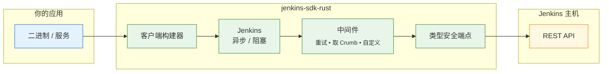

<!-- ─── 语言切换 & 目录（右上角） ─────────────────────────────── -->
<div align="right">

<a href="README.md">🇺🇸 English</a> ·
<a aria-disabled="true" style="color:#999;text-decoration:none;">🇨🇳 中文</a> &nbsp;&nbsp;&nbsp;&nbsp;&nbsp;&nbsp;|&nbsp;&nbsp;&nbsp;&nbsp;&nbsp; 目录 ↗️

</div>

<h1 align="center"><code>jenkins-sdk-rust</code></h1>

<p align="center">
  📦 <strong>纯 Rust 实现的 Jenkins API SDK</strong> — 同时支持 <em>异步</em> 与 <em>阻塞</em> 客户端、类型安全端点、可插拔中间件，拒绝魔法字符串。
</p>

<div align="center">
  <a href="https://crates.io/crates/jenkins-sdk">
    
  </a>
  <a href="https://docs.rs/jenkins-sdk">
    
  </a>
  <a href="https://github.com/lvillis/jenkins-sdk-rust/actions">
    
  </a>
  <a href="https://img.shields.io/crates/dr/jenkins-sdk?color=ba86eb">
    
  </a>
  <a href="https://github.com/lvillis/jenkins-sdk-rust">
    
  </a>
  <a href="mailto:lvillis@outlook.com?subject=Thanks%20for%20jenkins-sdk-rust!">
    
  </a>
</div>

---

## ✨ 功能特性

| 功能             | 说明                                                |
|----------------|---------------------------------------------------|
| **异步 & 阻塞**    | 编译期选择 I/O 模型：默认 `tokio`，如需同步启用 `blocking-client`。 |
| **类型安全端点**     | 每个 API 调用都是实现 `Endpoint` 的零成本结构体；响应直接反序列化为具体类型。   |
| **可组合中间件**     | 内置 CSRF Crumb 获取、重试、定制传输等，链式调用自由扩展。               |
| **无魔法字符串**     | URL 构造、查询/表单编码、错误映射、JSON 解码全由 SDK 处理。             |
| **纯 Rust，依赖轻** | 基于 `reqwest`+`rustls`，0 C 依赖，体积小巧。                |

## 🖼 架构总览

<details open>
<summary>点击折叠 / 展开</summary>



</details>

## 🚀 支持的 API 列表

| 分类  | 功能           | 方法     | 路径                                 | 状态 |
|-----|--------------|--------|------------------------------------|----|
| 作业  | 获取所有作业信息     | `GET`  | `/api/json`                        | ✅  |
| 作业  | 获取单个作业详情     | `GET`  | `/job/:name/api/json`              | ✅  |
| 作业  | 获取最近一次构建信息   | `GET`  | `/job/:name/lastBuild/api/json`    | ✅  |
| 作业  | 获取指定构建日志     | `GET`  | `/job/:name/:id/consoleText`       | ✅  |
| 作业  | 获取最近一次构建日志   | `GET`  | `/job/:name/lastBuild/consoleText` | ✅  |
| 作业  | 触发带参数构建      | `POST` | `/job/:name/buildWithParameters`   | ✅  |
| 作业  | 停止进行中的构建     | `POST` | `/job/:name/:id/stop`              | ✅  |
| 队列  | 获取构建队列详情     | `GET`  | `/queue/api/json`                  | ✅  |
| 执行器 | 获取节点 / 执行器状态 | `GET`  | `/computer/api/json`               | ✅  |

## 📥 安装

```shell
# 一键添加依赖（异步客户端）
cargo add jenkins-sdk
```

```toml
# Cargo.toml（默认异步客户端）
[dependencies]
jenkins-sdk = "0.1"

# 同步客户端
# jenkins-sdk = { version = "0.1", default-features = false, features = ["blocking-client"] }
```

## ⚡快速开始

### 异步示例

```rust
use jenkins_sdk::JenkinsAsync;
use jenkins_sdk::core::{QueueLength, ExecutorsInfoEndpoint};
use std::time::Duration;

#[tokio::main]
async fn main() -> anyhow::Result<()> {
    // 构建客户端
    let jenkins = JenkinsAsync::builder("https://jenkins.example.com")
        .auth_basic("user", "apitoken")
        .no_system_proxy()
        .with_retry(3, Duration::from_millis(300))
        .with_crumb(Duration::from_secs(1800))
        .build();

    // 队列长度
    let q: serde_json::Value = jenkins.request(&QueueLength).await?;
    println!("队列条目数 = {}", q["items"].as_array().map_or(0, |a| a.len()));

    // 执行器状态
    let ex = jenkins.request(&ExecutorsInfoEndpoint).await?;
    println!("空闲执行器 = {}", ex.idle_executors);

    Ok(())
}
```

### 阻塞示例

```rust
// 需要: default-features = false, features = ["blocking-client"]
use jenkins_sdk::JenkinsBlocking;
use jenkins_sdk::core::QueueLength;
use std::time::Duration;

fn main() -> anyhow::Result<()> {
    let jenkins = JenkinsBlocking::builder("https://jenkins.example.com")
        .auth_basic("user", "apitoken")
        .timeout(Duration::from_secs(15))
        .with_retry(2, Duration::from_millis(250))
        .build();

    let q: serde_json::Value = jenkins.request(&QueueLength)?;
    println!("队列条目数 = {}", q["items"].as_array().unwrap().len());

    Ok(())
}
```

## 📜 更新日志

详细变更请见 [CHANGELOG.md](CHANGELOG.md) .

## 📃 许可证

本项目基于 MIT License 发布