<!-- ─── 语言切换 & 目录（右上角） ─────────────────────────────── -->
<div align="right">

<a href="README.md">🇺🇸 English</a> ·
<a aria-disabled="true" style="color:#999;text-decoration:none;">🇨🇳 中文</a> &nbsp;&nbsp;&nbsp;&nbsp;&nbsp;&nbsp;|&nbsp;&nbsp;&nbsp;&nbsp;&nbsp; 目录 ↗️

</div>

<h1 align="center"><code>jenkins-sdk-rust</code></h1>

<p align="center">
  📦 <strong>纯 Rust 实现的 Jenkins API SDK</strong> — 同时支持 <em>异步</em> 与 <em>阻塞</em> 客户端、类型安全端点、可插拔中间件，拒绝魔法字符串。
</p>

<div align="center">
  <a href="https://crates.io/crates/jenkins-sdk">
    
  </a>
  <a href="https://docs.rs/jenkins-sdk">
    
  </a>
  <a href="https://github.com/lvillis/jenkins-sdk-rust/actions">
    
  </a>
  <a href="https://img.shields.io/crates/dr/jenkins-sdk?color=ba86eb">
    
  </a>
  <a href="https://github.com/lvillis/jenkins-sdk-rust">
    
  </a>
  <a href="mailto:lvillis@outlook.com?subject=Thanks%20for%20jenkins-sdk-rust!">
    
  </a>
</div>

---

## ✨ 功能特性

| 功能             | 说明                                                |
|----------------|---------------------------------------------------|
| **异步 & 阻塞**    | 编译期选择 I/O 模型：默认 `tokio`，如需同步启用 `blocking`。 |
| **核心 Service** | 通过 `client.jobs()/queue()/system()/...` 访问 Jenkins Core API，无需手写路径。 |
| **可组合中间件**     | 内置 CSRF Crumb 获取、重试、定制传输等，链式调用自由扩展。               |
| **无魔法字符串**     | URL 构造、查询/表单编码、错误映射、JSON 解码全由 SDK 处理。             |
| **纯 Rust，依赖轻** | 基于 `reqwest`+`rustls`，0 C 依赖，体积小巧。                |

## 🖼 架构总览

```mermaid
flowchart LR
%% —— 你的应用 ——
    subgraph A["你的应用"]
        direction TB
        CLI["二进制 / 服务"]
    end

%% —— SDK 核心 ——
    subgraph S["jenkins-sdk-rust"]
        direction LR
        Builder["客户端构建器"] --> Client["Jenkins<br/>异步 / 阻塞"] --> Middleware["中间件<br/><sub>重试 • 取 Crumb • 自定义</sub>"] --> Service["核心 Service<br/><sub>jobs • queue • system • ...</sub>"]
    end

%% —— Jenkins 主机 ——
    subgraph J["Jenkins 主机"]
        API["REST API"]
    end

%% —— 流向 ——
    CLI --> Builder
    Service --> API

%% —— 样式 ——
    classDef app fill:#e3f2fd,stroke:#1976d2,stroke-width:1px;
    classDef sdk fill:#e8f5e9,stroke:#388e3c,stroke-width:1px;
    classDef server fill:#fff8e1,stroke:#f57f17,stroke-width:1px;

    class CLI app;
    class Builder,Client,Middleware,Service sdk;
    class API server;
```

<details open>
<summary>点击折叠 / 展开</summary>



</details>

## 🚀 支持的 API 列表

| Service         | Jenkins Core API                                                                                          | 状态 |
|----------------|-----------------------------------------------------------------------------------------------------------|----|
| `system()`     | `/api/json`、`/whoAmI/api/json`、`/crumbIssuer/api/json`、`/overallLoad/api/json`、`/loadStatistics/api/json`、`/jnlpJars/agent.jar`、`/jnlpJars/jenkins-cli.jar`、`/config.xml` get/update、`/quietDown`/`cancelQuietDown`/`reload`/`safeRestart`/`restart`/`exit` | ✅  |
| `jobs()`       | list/get + lastBuild selectors、build info、`consoleText`、`logText/progressiveText`、artifact download、stop/term/kill/doDelete/toggleLogKeep/submitDescription、`config.xml` get/update、`createItem`(xml)、copy/rename/delete/enable/disable | ✅  |
| `queue()`      | list/item/cancel                                                                                          | ✅  |
| `computers()`  | list/computer + typed `executors_info()`、`doCreateItem`(xml)/copy、toggleOffline/doDelete、`config.xml` get/update、connect/disconnect/launchSlaveAgent | ✅  |
| `views()`      | list/get、createView(xml)、`config.xml` get/update、doDelete/doRename、addJobToView/removeJobFromView | ✅  |
| `users()`      | `/user/<id>/api/json`、`/whoAmI/api/json`、`config.xml` get/update | ✅  |
| `people()`     | `/people/api/json`、`/asynchPeople/api/json` | ✅  |

## 📥 安装

```shell
# 一键添加依赖（异步客户端）
cargo add jenkins-sdk
```

```toml
# Cargo.toml（默认异步客户端）
[dependencies]
jenkins-sdk = "0.1"

# 同步客户端（TLS 二选一）
# jenkins-sdk = { version = "0.1", default-features = false, features = ["blocking", "rustls"] }
# jenkins-sdk = { version = "0.1", default-features = false, features = ["blocking", "native-tls"] }
```

## ⚡快速开始

> Jenkins 基础地址可以带子路径（如 `https://example.com/jenkins`），尾部 `/` 可省略，SDK 会自动补齐并正常拼接 API 路径。

### 异步示例

```rust
use jenkins_sdk::Client;
use std::time::Duration;

#[tokio::main]
async fn main() -> anyhow::Result<()> {
    // 构建客户端
    let jenkins = Client::builder("https://jenkins.example.com")?
        .auth_basic("user", "apitoken")
        .no_system_proxy()
        .with_retry(3, Duration::from_millis(300))
        .with_crumb(Duration::from_secs(1800))
        .build()?;

    // 队列长度
    let q: serde_json::Value = jenkins.queue().list(None).await?;
    println!("队列条目数 = {}", q["items"].as_array().map_or(0, |a| a.len()));

    // 执行器状态
    let ex = jenkins.computers().executors_info().await?;
    println!("空闲执行器 = {}", ex.idle_executors);

    Ok(())
}
```

### 阻塞示例

```rust
// 需要: default-features = false, features = ["blocking", "rustls"]
// 或者: default-features = false, features = ["blocking", "native-tls"]
use jenkins_sdk::BlockingClient;
use std::time::Duration;

fn main() -> anyhow::Result<()> {
    let jenkins = BlockingClient::builder("https://jenkins.example.com")?
        .auth_basic("user", "apitoken")
        .timeout(Duration::from_secs(15))
        .with_retry(2, Duration::from_millis(250))
        .build()?;

    let q: serde_json::Value = jenkins.queue().list(None)?;
    println!("队列条目数 = {}", q["items"].as_array().unwrap().len());

    Ok(())
}
```

### 任意接口（Unstable Raw Request）

启用 `unstable-raw` feature 后，当某个 API endpoint 还没建模时，可使用 `raw::Request` + `execute()`：

```rust
use jenkins_sdk::Client;
use jenkins_sdk::raw::Request;

# async fn demo(client: Client) -> Result<(), jenkins_sdk::Error> {
let resp = client
    .execute(&Request::get(["api", "json"]).query_pair("tree", "jobs[name]"))
    .await?;
let root: serde_json::Value = resp.json()?;
println!("{root:?}");
# Ok(())
# }
```

> 注意：在 Tokio runtime 中使用阻塞客户端时，请通过 `tokio::task::spawn_blocking` 或专用线程池调用。

## 📜 更新日志

详细变更请见 [CHANGELOG.md](CHANGELOG.md) .

## 📃 许可证

本项目基于 MIT License 发布
